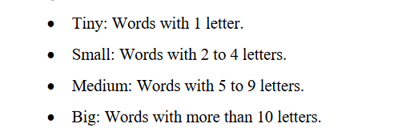

# Cấu trúc nộp bài
- thay "ABC" thành tên nhóm

## Yêu cầu labs:
1. ** cài đặt máy thành Single Node Cluster - SNC **
**Tutorials**: <href>https://hadoop.apache.org/docs/stable/hadoop-project-dist/hadoop-common/SingleCluster.html</href>
* **Lưu ý**
    - cái shell chụp màn hình cần có mssv của người làm
    - Đổi shell prompt thành mssv
    - tạo user mới -> mssv
2.  **Đọc paper trả lời câu hỏi liên quan đến map reduce**
* **Link bài báo:**
<href>https://research.google/pubs/mapreduce-simplified-data-processing-on-large-clusters/</href>
* **Câu hỏi:**
- How do the input keys-values, the intermediate keys-values, and the output keys-values relate?
- How does MapReduce deal with node failures?
- What is the meaning and implication of locality? What does it use?
- Which problem is addressed by introducing a combiner function to the MapReduce model?
**3.  Word Count project**
* **Tutorial:**
<href>https://www.slideshare.net/oom65/hadoop-security-architecture</href>
- code -> tạo file jar -> chạy thử trên clustẻ
- Chụp màn hình minh chứng và giải thích ngắn gọn
**4.  Bài tập điểm thưởng**
4.1. Đếm bao nhiêu từ trong mỗi nhóm: tiny, small, medium, big -> cải tiến từ word count

4.2. (1.5đ) *Hoàn thành cài đặt mode Phân tán -> trên ít nhất 2 máy -> chụp hình kết quả kèm giải thích ngắn gọn -> 1đ*

*Cài đặt Hadoop chế độ an toàn (Secure mode) -> trả lời các câu hỏi:*
    • Is your Hadoop secure? Give a short explanation if your answer is yes. Otherwise, give some examples
    of risks to your system.
    • From your perspective, which method is better when securing your HDFS: authentication,
    authorization, or encryption? Give an explanation about your choices

## Deadline
18/3/2024 -> 31/3/2024
**Đề xuất chia thành 3 giai đoạn**
Giai đoạn 1 (Tất cả cùng làm):
* Tạo Overleaf để viết report cho cả team
* Cài đặt được hadoop chế độ standalone

**-> Dealine: Hết chủ nhật 24/3/2024**
### Meeting 20h chủ nhật 24/3/2024 -> triển khai giai đoạn 2
Giai đoạn 2 (vừa làm vừa viết report):
* Cài đặt máy thành SNC  + đọc paper và trả lời các câu hỏi ở phần 2 (làm song song + trả lời câu hỏi thì) 
  * Deadline dự kiến: **hết 27/3/2024**
  * Người làm: **cả team**
  * Output: **Mỗi người 1 file .txt trả lời câu hỏi**
* Tổng hợp viết vào Overleaf đã tạo:
  * Deadline dự kiến: **hết 28/3/2024**
  * Người làm: **cả team**
  * Output: **1 file .pdf**
### Meeting 13h 27/3/2024 -> báo cáo giai đoạn 2 + triển khai giai đoạn 3
Giai đoạn 3 (chia ra làm + viết report):
* Code chương trình word count + chạy thử:
  * Deadline: **hết 29/3/2024**
  * Người làm: ***Trung, Kỳ Thanh***
* Bonus làm phần 1 của bonus: 
  * Deadline: **hết 29/3/2024**
  * Người làm: ***Triết, Hưng***
* Bonus làm phần 2 của bonus:
  * Dealine **hết 30/3/2024**
  * Người làm: **Cả team**

